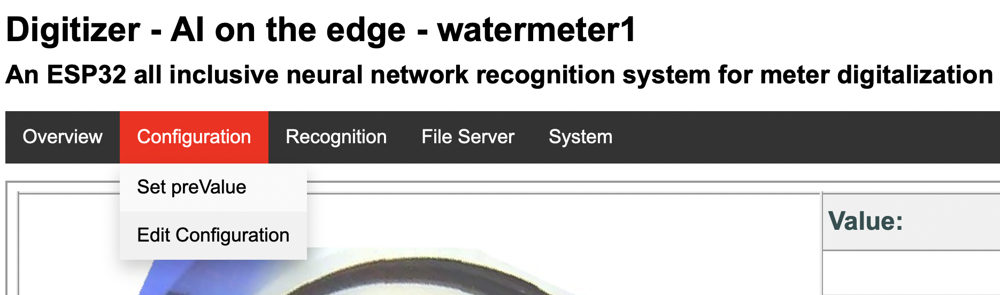
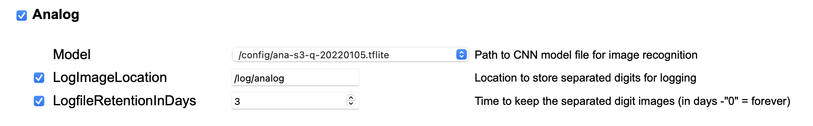
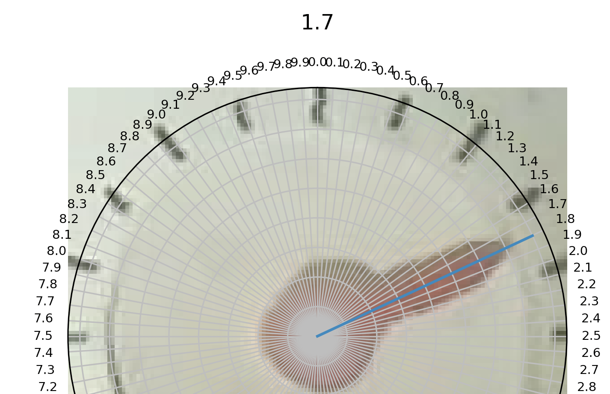
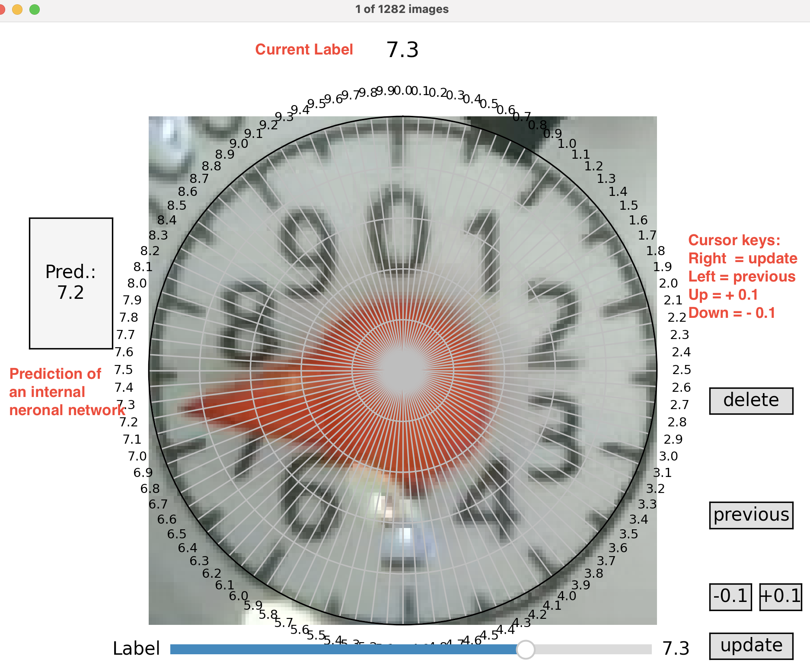

# Image Collection And Labeling App For Analog Pointer

Help us to get more image data and improve the analog pointer predictions of your meter device!


## Device Preparation

### 1. Configure ROIs (Regions Of Interest) properly

Before you read out the images, have to properly configure your ROIs. It is essential to have good images to 
successfully train the neuronal network. Please check 
[ROI Configuration Documenation](https://github.com/jomjol/AI-on-the-edge-device/wiki/ROI-Configuration).

**Note: It is important to have the center of the analog pointer centered of the ROI image.**

### 2. Enable Image Logging

Before you can read the images, you have to configure the logging of the pointers in your device.
1. Go to you devices and open the configuration.
<br>
2. Now setup the *LogfileRetentionsInDays*. You have to select the checkbox if not already configured.
Please do not change the path of *LogImageLocation* ( /log/analog )
<br>
3. After enabling the image logging, you need wait a few days before you can readout all the images.


## Image Collection

### Installation

#### Option 1: Precompiled Executables (Windows, MacOS, Linux)

The [releases](https://github.com/haverland/collectmeteranalog/releases) contains packages for the  operating systems Windows, Linux and MacOS.
Download the suitable package, unzip the content and call the console application from command line / terminal:

```bash
# Windows
collectmeteranalog.exe --collect=<METER IP or NAME>

# Linux
./collectmeteranalog --collect=<METER IP or NAME>

# macOS
./collectmeteranalog --collect=<METER IP or NAME>
```

The application startup is a little bit slow. If everthing is configured properly, it's starting with downloading 
all images of the last three days (suing default parameter: --days=3) from the meter and save the images into a subfolder 
called `data`. The image names will be hashed for your privacy. Be patiant, it will takes a while. After the download is 
completed any duplicates will be automaticly removed. Finally you have a folder named `data/labled` with the pre-processed images.

#### Option 2: Python Package

1. Install Python from [python.org](https://www.python.org/downloads/) if not already installed. .
2. Install the package:
```bash
    pip install git+https://github.com/haverland/collectmeteranalog
```
3. Collect images:
```bash
    python -m collectmeteranalog --collect=<METER IP or NAME>
```
The application startup is a little bit slow. If everthing is configured properly, it's starting with downloading 
all images of the last three days (suing default parameter: --days=3) from the meter and save the images into a subfolder 
called `data`. The image names will be hashed for your privacy. Be patiant, it will takes a while. After the download is 
completed any duplicates will be automaticly removed. Finally you have a folder named `data/labled` with the pre-processed images.

#### Install Prediction Capability For Image Labeling (Optional)

Windows and MacOS excecutables do not have any prediction functionality pre-installed, because the tflite-runtime is only available for linux and 
the complete tensorflow library is to large (600MB) for a single file application. This functionality is only used for labeling the images, but
it will also functional without installation. The predicted value will not be displayed.

To install this functionality:
```bash
# Windows
pip install tensorflow

# Mac
pip install tensorflow-macos 
```

## Image Labeling

This application can also be used to properly label the images or adjust existing labels.
Either labeling process is started automatically and opens the label window after image collection is completed 
or application can be started manually just for image labeling.

    1. Start the application to label all images in `IMAGE FOLDER`:
        python -m collectmeteranalog --labeling="<PATH TO IMAGE FOLDER>"

    2. Start the application to only label images in `IMAGE FOLDER` which are listed in provided label csv file:
        python -m collectmeteranalog --labeling="<PATH TO IMAGE FOLDER>" --labelfile="<PATH TO LABEL FILE>"

If images shall be evaluated by an given tensorflow model to show a the predicted value (default: --model=off --> No prediction by model)

    3.   
        python -m collectmeteranalog --labeling="<PATH TO IMAGE FOLDER>" --model="<PATH TO MODEL FILE>
        python -m collectmeteranalog --labeling="<PATH TO IMAGE FOLDER>" --labelfile="<PATH TO LABEL FILE>" --model="<PATH TO MODEL FILE>


There are multiple ways to update the label:
    - Press the `+1.0`, `+0.1`, `-1.0` or `-0.1` buttons on the right lower side.
    - Use the `pageup`, `up`, `pagedown` or `down` keys.  
    - Click onto the pointer on the plot

If you using click option, beware that it set the ticks. But sometimes the ticks are not correct, because the image
is moved or shared.



This pointer is a 1.7. Look at the marks. The 1.5 is under Tick 1.6. So if you click it would label a 1.8. 
We want label like a human would be read the pointer.


If it is correctly, you can click on update. If not use the slider to adjust it.

The prediction on the left side can help you to identify the number. But be aware the model can be only a help for you. **Don't trust the recognition!**



After all images are labeled, the window closes automatically.

### Syntax of label file (Parameter: --labelfile)
The label file is mainly used to optimize existing labels. Usually it is generated out of an model traning process. It lists only images which e.g. have a bad prediction.

Supported syntax: 
```bash
# Modern syntax (header names + additional infos) --> Predicted value is displayed during label process (no external model selected)
Header:     Index,File,Predicted,Expected,Deviation
Data rows:  0,1.3_1fe175f541247c9266791695b0689d43.jpg,2.2,1.3,0.9
            1,4.7_1ea28f634a44dbe1b67cce91d96b08c2.jpg,3.9,4.7,0.8
            2, ...

# Legacy syntax (no header names, only index and filename column)
Header:     ,0
Data rows:  0,/data_raw_images/1.3_1fe175f541247c9266791695b0689d43.jpg
            1,/data_raw_images/4.7_1ea28f634a44dbe1b67cce91d96b08c2.jpg
            2, ...
```

## Options / Parameters

List all available options

    python -m collectmeteranalog

Prediction functionality for the image labeling part can be switched off

    python -m collectmeteranalog --collect=<METER IP OR NAME> --model=off
    python -m collectmeteranalog --labeling="<PATH>" --model=off

Sometimes the labels on the ticks are to tight. You can change the ticks with

    python -m collectmeteranalog --collect=<METER IP OR NAME> --ticksteps=2
    python -m collectmeteranalog --labeling="<PATH>" --ticksteps=2

To remove similar images: The images must be stored in `data/raw_images`

    python -m collectmeteranalog --collect=<METER IP OR NAME> --nodownload

You can keep the downloaded images with option --keepdownloads

    python -m collectmeteranalog --collect=<METER IP OR NAME> --keepdownloads

If the labeling takes to long, you can later restart at a given number

    python -m collectmeteranalog --collect=<METER IP OR NAME> --nodownload --startlabel <NUMBER>

Sometimes it's usefull to change the similiar image recognition. The parameter is default 2. Smaller values for less 
similiars, higher values if you have to much similiars.

    python -m collectmeteranalog --collect=<METER IP OR NAME> --similiarbits=1


## Ready to share

After labeling you find the images under **"data/labeled"**.

Zip the folder. If it is smaller than 2MB you can mail it to iotson(at)t-online.de. Else please contact us, to find a other way.
